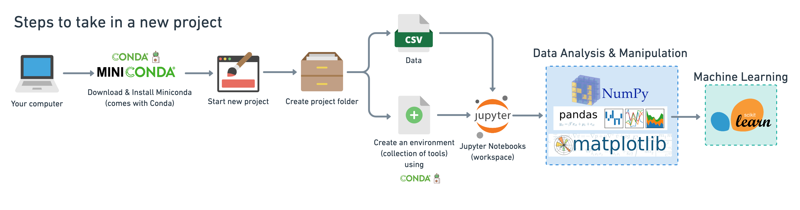

# ${\color{white}Time\ Series\ Analysis\ Regression}$

## Software And Tools Requirements

1. [GithubAccount](https://github.com)
2. [HerokuAccount](https://heroku.com)
3. [VSCodeIDE](https://code.visualstudio.com/)
4. [GitCLI](https://git-scm.com/downloads)
5. [AnacondaPackage/JupyterNoteBook](https://www.anaconda.com/products/distribution)

## Creata a New Environment and Activate!!

```
conda create -p venv python==3.9 -y
conda activate venv/
```

## Install all the Required Libraries!!

```
pip install -r requirements.txt
```
# Getting started with the Project!!

## ${\color{cyan}1.\ Problem \ Statement:}$
### ${\color{darkgray}Predict \ the \ sales \ price \ of \ Bulldozers, \ given \ a \ Time-Series \ Dataset}$
&nbsp;

## ${\color{cyan}2.\ Dataset \ Info:}$
### ${\color{darkgray}The \ dataset \ has \ been \ downloaded \ from \ }$[Kaggle](https://www.kaggle.com/c/bluebook-for-bulldozers/overview)
&nbsp;

* ### ${\color{darkgray}Since \ we \ already \ have \ a \ dataset, \ we'll \ approach \ the \ problem \ with \ the \ following \ machine \ learning \ modelling \ framework.}$
&nbsp;

&nbsp;

* ### ${\color{darkgray}To \ work \ through \ these \ topics,\  we'll \ use \ pandas, \ Matplotlib \ and \ NumPy \ for \ data \ anaylsis, \ as \ well \ as, \ Scikit-Learn \ for \ machine \ learning \ and \ modelling \ tasks.}$
&nbsp;

&nbsp;

* ### ${\color{darkgray}To \ Start \ with \ a \ New \ Project \ we \ are \ following \ the \ below \ mentioned \ steps.}$
&nbsp;

&nbsp;

* ### ${\color{darkgray}As \ we \ are \ using \ Sci-Kit \ Learn \ to \ do \ Modelling(Step-5);\ We \ will \ be \ following \ SkLearn \ Workflow.}$
&nbsp;

&nbsp;

* ### ${\color{darkgray}Attached\ below\ is\ the\ SKLearn's\ ML\ Mapping\ PNG\ file;\ which\ we\ will\ be\ referring\ to\ in\ order\ to\ select\ a\ Model.}$
&nbsp;

&nbsp;